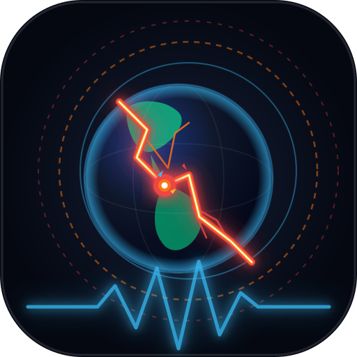

# 🌍 DETECCION-SISMO — Monitoreo Sísmico en Vivo & PWA

<div align="center">



### Sistema Comunitario de Alerta Temprana, Telemetría y Correlación Sísmica Multifuente


**Dedicado a la ciencia abierta, la prevención de desastres y la democratización del acceso a datos sismológicos en tiempo real.**

[Características](#-características-principales) • [PWA Móvil & Liquid Glass](#-pwa-móvil-tablet-y-liquid-glass-bar) • [Arquitectura](#-arquitectura-del-sistema) • [Instalación](#-instalación-y-acceso-en-red-local) • [Documentación Técnica](DETECCION_SISMO.md)

</div>

---

## 💡 Filosofía y Propósito

> *"El conocimiento cobra su verdadero valor cuando se pone al servicio de la protección y bienestar de los demás."*

**DETECCION-SISMO** nace como una herramienta comunitaria y de código abierto para centralizar, correlacionar y modelar eventos sísmicos en tiempo real sin barreras. Integra redes nacionales (**SGC de Colombia**) e internacionales (**USGS** y **EMSC**), calculando al instante atenuaciones de intensidad, tiempos de arribo de ondas destructivas y áreas de impacto físico sobre una interfaz fluida accesible desde cualquier ordenador, tableta o dispositivo móvil.

---

## 🌟 Características Principales

* 📡 **Ingestión Multifuente 24/7**:
  * 🇨🇴 **SGC (Servicio Geológico Colombiano)**: Consulta directa de eventos locales de alta precisión instrumental.
  * 🌐 **USGS (US Geological Survey)**: Telemetría global instantánea vía feeds GeoJSON.
  * ⚡ **EMSC (Euro-Mediterranean Seismological Centre)**: Conexión WebSocket push en tiempo real.
* 🧠 **Motor de Correlación Espaciotemporal**:
  * Fusión y consenso de reportes entre agencias ($\Delta t \le 120\text{s}$, $\Delta d \le 90\text{km}$) para evitar duplicados y comparar lecturas de magnitud.
* 📐 **Modelado Físico & Atenuación Sísmica**:
  * Estimación de Intensidad Mercalli Modificada (**MMI**) y Aceleración Pico del Suelo (**PGA %g**).
  * Radios de afectación física: **Daño Potencial** (🔴 $MMI \ge VII$), **Sacudida Fuerte** (🟠 $MMI \ge V$) y **Radio Perceptible Total** (🟡).
* 🌊 **Simulador de Frentes de Onda y ETA**:
  * Propagación de **Onda P** ($6.0\text{ km/s}$) y **Onda S destructiva** ($3.5\text{ km/s}$) con cuenta regresiva en vivo hacia ciudades principales.
* 📱 **Experiencia PWA & Liquid Glass Bar**:
  * Barra de navegación móvil flotante de cristal líquido con física elástica (*spring capsule*) y respuesta háptica.
  * Instalable en **Android, iOS (iPhone/iPad) y PC** como aplicación nativa independiente con soporte offline.
* 🗺️ **Centro Cartográfico de Alto Rendimiento**:
  * Renderizado acelerado por GPU sobre HTML5 Canvas (60 FPS estables).
  * 4 mapas base (🌙 Oscuro, 🛰️ Satélite Esri, ☀️ Claro, 🗺️ Calles OSM) con capas de **Fallas Geológicas Activas** y **Placas Tectónicas**.
* 🔊 **Sintetizador de Audio Procedural**:
  * Alertas acústicas generadas en tiempo real con la **Web Audio API** según la magnitud detectada.
* 💾 **Persistencia Continua en SQLite**:
  * Base de datos local sin dependencias pesadas (`node:sqlite`) con exportación a **CSV** y **JSON**.

---

## 📱 PWA Móvil, Tablet y Liquid Glass Bar

Diseñada bajo los más altos estándares de ergonomía móvil y estética *Glassmorphism*:

```
┌──────────────────────────────────────────────────────────────┐
│                                                              │
│                    MAPA LEAFLET 100% FULLSCREEN              │
│                                                              │
│        ┌───────────────────────────────────────────────┐     │
│        │  🗺️ Mapa  📋 Feed   ⚡ Ondas   📊 Métricas  ⚙️  │     │  <-- Liquid Glass Bar
│        └───────────────────────────────────────────────┘     │
└──────────────────────────────────────────────────────────────┘
```

* **Liquid Glass Navigation Bar:** Barra flotante inferior translúcida con `backdrop-filter: blur(28px)`, efecto de bisel de luz y cápsula de seguimiento animada.
* **Bottom Sheets Deslizables:** Hojas modales táctiles para consultar el feed cronológico, el desglose de frentes de onda y las métricas del sistema.
* **Adaptación Híbrida para Tablets:**
  * **Modo Vertical (*Portrait*):** Interfaz táctil ergonómica con barra flotante al alcance del pulgar.
  * **Modo Horizontal (*Landscape*):** Vista extendida estilo escritorio con paneles laterales y mapa panorámico.

---

## 🏛️ Arquitectura del Sistema

```
  ┌──────────────┐      ┌──────────────┐      ┌────────────────────┐
  │ SGC Colombia │      │ USGS Global  │      │ EMSC WebSocket     │
  │ POST Polling │      │ GeoJSON Feed │      │ Push en vivo 24/7  │
  └──────┬───────┘      └──────┬───────┘      └─────────┬──────────┘
         │                     │                        │
         └──────────────┬──────┴────────────────────────┘
                        │
                        ▼
         ┌──────────────────────────────┐
         │ MOTOR DE CORRELACIÓN SÍSMICA │
         │ - Clustering Spatiotemporal  │
         │ - MMI Mercalli & PGA %g      │
         │ - Radios de Daño & Ondas P/S │
         └──────────────┬───────────────┘
                        │
         ┌──────────────┴──────────────┐
         ▼                             ▼
  ┌──────────────┐             ┌────────────────┐
  │ SQLite 24/7  │             │ Socket.io WS   │
  │ data/sismos  │             │ Difusión <50ms │
  └──────────────┘             └───────┬────────┘
                                       │
                                       ▼
                       ┌────────────────────────────────┐
                       │   FRONTEND / PWA RESPONSIVO    │
                       │ - Leaflet Canvas Hardware GPU  │
                       │ - Liquid Glass Navigation Bar  │
                       │ - Service Worker & Web Audio   │
                       └────────────────────────────────┘
```

---

## 🚀 Instalación y Acceso en Red Local

### 1. Clonar e Instalar
```bash
git clone https://github.com/tu-usuario/deteccion-sismo.git
cd deteccion-sismo
npm install
```

### 2. Iniciar el Servidor
```bash
npm start
```

El servidor detectará tus interfaces de red y mostrará los enlaces disponibles:
```text
================================================================
🌍 DETECCION-SISMO — SERVIDOR Y RECOLECTOR EN TIEMPO REAL
📍 Acceso Local (PC):       http://localhost:3000
📱 Acceso Móvil / Tablet:  http://192.168.1.13:3000  (Wi-Fi)
💾 Base de Datos SQLite:    data/sismos.db
================================================================
```

### 3. Instalar la PWA en tus Dispositivos
* **En Android / Tablet:** Abre la dirección IP en Chrome y presiona **"Agregar a pantalla principal"** o **"Instalar aplicación"**.
* **En iPhone / iPad:** Abre la dirección en Safari, pulsa **Compartir (⎋)** y selecciona **"Agregar al inicio"**.
* **En PC (Chrome/Edge):** Haz clic en el icono de instalación ubicado en el extremo derecho de la barra de direcciones.

---

## 🔌 API REST

| Método | Endpoint | Descripción |
|---|---|---|
| `GET` | `/api/sismos` | Lista de sismos filtrados (`limit`, `country`, `minMag`, `hours`, `source`) |
| `GET` | `/api/stats` | Estadísticas globales, Colombia 24h, evento más fuerte y estado de redes |
| `GET` | `/api/db/stats` | Métricas y conteo de registros en la base SQLite local |
| `GET` | `/api/export/csv` | Descarga de base de datos completa en formato `.csv` |
| `GET` | `/api/export/json` | Descarga de base de datos completa en formato `.json` |
| `GET` | `/api/plates` | GeoJSON con las placas tectónicas globales |
| `GET` | `/api/faults` | GeoJSON con las fallas geológicas activas de Colombia |
| `POST` | `/api/refresh` | Fuerza actualización manual inmediata contra las 3 redes |
| `POST` | `/api/config/polling` | Modifica en caliente los intervalos de consulta de SGC y USGS |

---

## 📖 Documentación Técnica

Para conocer a fondo las relaciones matemáticas de atenuación Joyner-Boore, velocidades de onda y arquitectura interna, consulta [**DETECCION_SISMO.md**](DETECCION_SISMO.md).

---

## 📄 Licencia

Distribuido bajo la Licencia **MIT**. Consulta el archivo [LICENSE](LICENSE) para más detalles.
